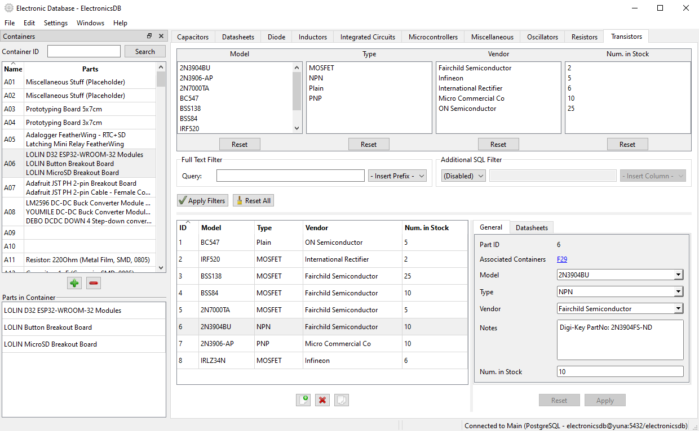

# ElectronicsDB

## Screenshot

## Overview

ElectronicsDB is a program for managing a personal collection of electronic components (_parts_). Each of these parts belongs to a _category_ and has a set of corresponding _properties_ that describe it. ElectronicsDB allows you to use these property values to search for parts in your collection.

Parts can also be put in one or more _containers_ (e.g. boxes in a component drawer), which allow you to quickly see where you've put your physical components.

For more information, you should **consult the manual** either [directly on GitHub](src/resources/doc/main.md) or by choosing the _Help / Open manual_ menu in the program itself.

## Supported Platforms

Currently, ElectronicsDB runs on Windows and Linux. It shouldn't be too hard to get it working on macOS as well, but I've never tested it, so some minor changes are probably necessary.

## Getting Started

The easiest way to get started is by downloading the binaries for your operating system on the GitHub releases page. Just run and/or install them and start ElectronicsDB.

When you first run ElectronicsDB, you will be greeted with a screen that tells you to create a new database connection. The easiest way to start is to define an SQLite database connection, and let ElectronicDB create the database file for you (just provide a path to a non-existent file). In the GitHub releases, you can also find a **skeleton SQLite database** that already has some part categories defined, so you can download and use that to get some parts in right away.

## Building from Source

ElectronicsDB uses CMake as a build system. For compilers, it currently supports GCC 8.0 and above (There are known compilation problems with GCC 7.x) on Linux, and MSVC 2019 or MinGW-W64 on Windows (the latter isn't regularly tested). A recent version of CMake (currently 2.20) is required.

ElectronicsDB has a couple of dependencies. Many are bundled in the repository and will be built automatically, but the following must be found elsewhere on the system:

* **[Qt](https://www.qt.io/) 6.x** or **Qt 5.15.2**: ElectronicsDB should work with both versions. Earlier 5.x versions aren't tested. Note that by default **you also need the Qt source code** of the version you decide to use, because ElectronicsDB will build some of the QtSql drivers from source for two reasons: Firstly, the MySQL/MariaDB driver currently isn't included in the official Qt binaries. Secondly, ElectronicDB requires a more recent version of SQLite than at least the Qt 5.15.2 binaries provide.
* The **[Xapian](https://xapian.org/)** library, used as a full text search engine. Xapian itself also requires **zlib**, so you need that as well.
* Either the **MySQL or MariaDB Connector for C**. This is required when building Qt's MySQL driver from source. You can choose to skip that by setting `EDB_BUILD_QMYSQL=OFF`.

A few more notes for getting the CMake configuration and build working:

* Be sure to set the CMake variable `EDB_QT_PLUGINS_SOURCE_PATH`. The directory you should point it to will look like this: `$QT_ROOTDIR$/Src/qtbase/src/plugins`
* If something else goes wrong, check the CMake error output. Most of the time you just need to set some paths in some variables to get it working.

ElectronicsDB's build system isn't very mature yet, so there might be issues here and there. Let me know if you find any.

### Prebuilt Dependencies for Windows

Because building some of the dependencies from source is a massive pain on Windows/MSVC (*I'm looking at you, Xapian*...), I will provide some prebuilt dependencies on the GitHub releases page. You can try them, but YMMV. Qt isn't included, because they have their own binaries which are perfectly fine (except for the lack of a MySQL driver).
