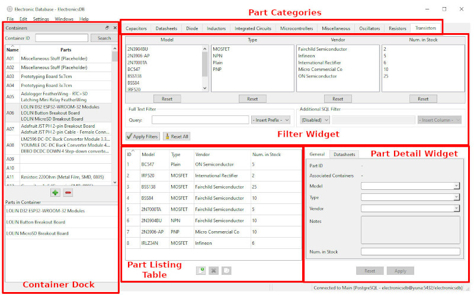

# ElectronicsDB Manual

## Overview

ElectronicsDB is a program for managing a personal collection of electronic components (_parts_). Each of these parts belongs to a _category_ and has a set of corresponding _properties_ that describe it. ElectronicsDB allows you to use these property values to search for parts in your collection.

Parts can also be put in one or more _containers_, which allow you to quickly see where you've put your physical components.

## Data Storage

ElectronicsDB uses an SQL database to store most of its data (e.g. parts with their property values and containers). Currently, the following SQL backends are supported:

* **SQLite**: This is the simplest option. SQLite stores the entire database in a single file on your disk. There's no need to install other software, as SQLite is fully embedded into ElectronicsDB. The only thing you have to configure in ElectronicsDB is the database file path.
* **PostgreSQL**: For advanced users. This can be used if you want your data to be on another machine (e.g. a NAS), maybe to access it from multiple machines. Note that ElectronicsDB needs a fast database connection in order to stay responsive, so you should think twice about hosting the database over the internet.
* **MySQL/MariaDB**: This is **not recommended**. It's the perhaps more widely available alternative to PostgreSQL. With MySQL/MariaDB, certain structural changes that ElectronicsDB does to the database will cause data corruption and/or data loss if an error occurs part way through, because for [technical reasons](https://dev.mysql.com/doc/refman/8.0/en/atomic-ddl.html) they can't be rolled back. If you care about your data even a little bit, I **strongly discourage** you from using this. Neither SQLite nor PostgreSQL have this problem.

You can configure more than one database connection, although most users will only ever need one.

ElectronicsDB requires (mostly) exclusive access to the database. This means two things: First of all, you have to give ElectronicsDB **an entire database of its own** (a schema of its own isn't enough. It must be an entire database). There shouldn't be any data from other programs in it, otherwise ElectronicsDB might actually delete this other data. Secondly, **no two instances of ElectronicsDB should have the same database open at the same time**. You can access the same database from multiple computers, but not at the same time. Ignoring this requirement can lead to some of the instances displaying old data, or even data corruption if you're unlucky.

### Other Data

While most data is stored in the SQL database, there are some things which are stored elsewhere.

**Files** that are referenced by part properties of the *file* datatype are stored in a dedicated directory on the file system (the **file root directory**). They might also be stored elsewhere on the file system, if you don't let ElectronicsDB copy the file for you.

**Settings** are stored in different locations depending on the operating system (e.g. config files on Linux, registry on Windows). This includes general program settings, database connection info, and stored passwords.

If you want to backup your data (you should!), it's normally sufficient to backup the SQL database and the file root directory. If file part properties reference files outside of the file root directory, you should back those up, too.

## ElectronicsDB Entities

The following sections will describe thes entities that are managed by ElectronicsDB in more detail.

### Parts

Parts are the most important entity managed by ElectronicsDB. Each part is a distinct model of electronic component (the terms _part_ and _component_ may be used interchangeably), with a set of properties describing it. Note that even if you have multiple pieces of such a component, they are still considered a **single** part in ElectronicsDB. For example: If you have five 1kΩ resistors, ten 2kΩ resistors, and three 100pF capacitors, then you have only 3 parts in ElectronicsDB.

#### Part Categories

Each part belongs to exactly one category. This category is what defines the properties that a part can have, and parts are always listed under their category. Examples for categories are: Resistors, capacitors, microcontrollers, etc.

#### Part Properties

A property is a single piece of information about a part. The set of available properties for a part is defined per-category, and they can have one of many different types (e.g. string, integer, float, file, ...). They are useful to see the most important specs of a part at a glance without having to open a datasheet, and they are the basis for ElectronicsDB's search and filter functionality.

The simplest form of properties are single-value properties. Examples for those are: A resistor's resistance value, a microcontroller's model name, an inductor's manufacturer, etc.

The other type are multi-value properties. Each part can have zero or more values for such a property. Examples are: The list of peripherals supported by a microcontroller, a set of keywords associated with an integrated circuit, etc.

#### Part Links

An advanced feature of ElectronicsDB is that different parts can be _linked_ to each other. This allows ElectronicsDB to show a list of linked parts when you view a part's details. An example for this is the _Datasheets_ part category, where each part represents a single datasheet (typically a PDF, so not a physical component). A microcontroller part can now be linked to one or more of these datasheets, so ElectronicsDB displays this list of datasheets whenever you select that microcontroller, and allows you to quickly jump to or open the datasheets.

### Part Containers

Part containers allow you to save the physical organization of your components in ElectronicsDB. The most common type of container you might have is a single box of a component drawer: Each of these boxes is supposed to store one type of component (or a few, but there's usually some sort of logic to it).

In ElectronicsDB, you can create and name those containers, and then drag one or more parts into it. You can then view the list of containers and quickly see which parts are in them, or jump to these parts. When you select a part, you can also see the list of containers that it is in. Each container can have zero or more parts, and each part can be in zero or more containers.

### The Static Model

It can be useful to distinguish between the _static model_ and the _dynamic model_ of the data that ElectronicsDB is working on. Most of the time when using ElectronicsDB, you will be editing the dynamic model. This includes adding/editing/removing parts or containers, adding/removing parts from containers, linking parts to each other, and so on. On the other hand, operations that edit the _static model_ include, but are not limited to:

* Adding or removing part categories
* Renaming categories or changing their description
* Adding or removing part properties
* Editing attributes of the part properties _themselves_, like changing a property name, datatype, flags, etc.
* Adding/removing/editing part link types (this does _not_ include linking parts in itself)

Before you start editing the static model, you should definitely read the corresponding section in the _Advanced Concepts_ below, as this is quite risky and can lead to **data corruption and/or loss**.

## User Interface

The following image shows the main user interface of ElectronicsDB, when you have an active database connection and a bunch of parts in your collection. The main elements in the boxes will be explained below.

### Part Categories

These are simply tabs for all of your part categories. All search and filter functionality in ElectronicsDB is currently specific to a single category.

### Filter Widget

Here you can specify filter criteria for the parts that are displayed in the listing table. By default, all parts are displayed. There are multiple ways of filtering:

* By choosing one or more values from the property selection lists, only parts with the selected values will be shown.
* In the _Full Text Filter_ field, you can specify a complex search query. The basic syntax is similar to what you would find in many web search engines like Google. You can try `AT*` to find strings like _ATmega_ or _ATtiny_, or `adafruit -feather` to find Adafruit products except the feather boards. ElectronicsDB uses Xapian to do this search, so you can look at [the Xapian docs](https://getting-started-with-xapian.readthedocs.io/en/latest/concepts/search/queryparser.html) for more details about the syntax.
* In *Additional SQL Filter*, you can write custom SQL filter code. This code is appended verbatim to the SQL `WHERE` clause, so you can define quite complex filters with it. In the left combo box, you have to select if your code is appended to the rest of the filter query using a logical `AND` or `OR`. With the right combo box, you can insert the SQL fields (column names) for each of the part properties into your code.

Note that if you use multiple ways of filtering at the same time, they are fused with a logical `AND`.

For your filter to become active, you always have to click the _Apply Filters_ button. Clicking _Reset All_ will reset all your filters, showing all parts in the listing table again.

### Part Listing Table

This is a table of all parts in the current category that match the current filter criteria, with most of their properties displayed. The leftmost property is always the part ID, which uniquely identifies the part in the database. You can right-click the table header to show or hide some of the properties, if you find that the table becomes too cluttered.

Selecting a part in the listing table will display it in the _Part Detail Widget_, where you can see and edit all its properties.

Below the table, you have buttons to add new parts, remove selected parts, or duplicate selected parts.

### Part Detail Widget

This widget shows all properties of the currently selected part from the listing table, and allows you to edit them. Changes you make in this widget will only be applied when you click the _Apply_ button, or when you select another listing table entry without saving (auto-save). You can also use the _File / Save all_ menu to apply the changes. The _Reset_ button will restore the properties to their old values.

The detail widget will display additional tabs for multi-value properties (unless they have the _Display in single field_ flag set) and linked parts. For linked parts, it will allow you to quickly jump to them or, if the linked part has exactly one _file_ property, quick-open the linked file.

### Container Dock

First of all: If you don't see this dock, you should click the _Windows / Add container widget_ menu.

This dock widget can be dragged to either edge of the main window, or left floating as a separate window. It displays a table of all your containers with all the parts in them. Selecting a container on the top will display its parts in the bottom list. You can use the buttons to add or remove containers. Double-clicking on a part in the bottom list will jump to it in the listing table. Double-clicking on a container in the top table will do the same, but only if the container has exactly one part in it. The search field at the top can be used to filter down the list of displayed containers (only simple wildcard queries like `A*` are allowed).

You can remove parts from containers by selecting them in the _bottom_ list and pressing the _Delete_ key (or with the right-click context menu). Parts are added to the containers by **dragging** them onto either of the two container dock lists. You can drag them either from the part listing table, or from other containers.

### Undo / Redo

A useful feature of ElectronicsDB is its _undo / redo_ mechanism. Most changes you make in the main interface can be reverted or replayed using the _Edit_ menu. The granularity of this is generally rather coarse, so _Edit part X_, _Remove parts Y and Z_ and _Add parts A and B to container C_ are each a single undo/redo action.

Note that not all actions can be undone/redone in this way. Specifically, any action that changes the _static model_ can't be reverted. These are mostly the actions accessible from the more advanced menus.

## Advanced Concepts

### The Key Vault

First of all: I have absolutely no background in cryptography, so it goes without saying that you probably **do not want to entrust any passwords you really care about to ElectronicsDB**.

The key vault allows you to save database connection passwords, so you don't have to type them in every time ElectronicsDB starts. If you only use SQLite databases, you will probably never need the vault, but it is useful for databases that require password authentication.

The vault can be configured in the _Settings / Settings_ menu, and a popup may appear the first time you connect to a database that requires password authentication.

The vault contains an encrypted version of the connection passwords, and is stored along with all the other settings of ElectronicsDB. Currently, it uses [libhydrogen](https://github.com/jedisct1/libhydrogen) for the encryption, with a combination of its secret-key and public-key algorithms. The encryption key can be derived from a user password (which becomes a kind of master password that you still have to input when connecting), or a fixed key compiled into ElectronicsDB can be used. The fixed key **does not provide strong security**, as an attacker can easily find it in ElectronicsDB's source code and use it to decrypt your passwords, so its effect is obfuscation at best. Still, it's probably secure enough for most people when using a dedicated password just for ElectronicsDB and having some backups in place.

Note that the key vault is not an actual password manager. There is currently no UI that allows you to actually view the passwords in it, and there's no guarantee that the vault won't become lost on an update, so you should still either remember the passwords stored in it, or store them in a dedicated password manager.

### Editing the Static Model

Using the menu _Settings / Static Model_, you can change the static model of the database, i.e. define your own categories, properties, and so on. Note that most of these functions are **very much in the beta stage**.

Changes to the static model will often change the basic structure of the database, which is always a risky operation and not always trivial. **I urge you** (this is stronger than a recommendation) to backup the database before editing the static model, as both mistakes by the user and errors in ElectronicsDB's code may be unrecoverable otherwise, even though ElectronicsDB does have certain (limited) failsafes in place if the database supports them. Missing support for these failsafes is also the main reason why MySQL/MariaDB is not recommended as a database backend.

Another important aspect to the **beta** state of the static model dialogs is that they will happily allow you to perform changes that will destroy your data without warning. One example is changing the datatype of a property. Depending on the database backend and the types involved, this may work as expected, may throw an error, or simply overwrite or corrupt your property values.

I won't document these dialogs further for now (because I'm too lazy, and they might still change anyway), but it's probably easiest to start from a filled database and see how it looks in these dialogs.

### Directly Editing the Database

As most of ElectronicsDB's data is stored in the SQL database, it is of course possible to edit this database directly using third-party tools. I _do_ in fact encourage you to do that if you know a bit about SQL. ElectronicsDB is not intended to be a tool that does _everything_, and some tasks can be accomplished faster or more easily with a bit of SQL code. The important part is **backing up the database** before you do that, and **shutting down ElectronicsDB** until you are done.

#### The Database Schema

I will only very broadly describe the database schema used by ElectronicsDB. Most of it can be figured out by analyzing a filled database, or shouldn't be too important to most users. Note that the schema might change between versions, and this documentation might not always be up-to-date. The most important tables in the database are:

* `pcat_*`: These tables hold the actual parts with most of their property values. Each column (except the ID) represents a single property, and each row represents a single part. The asterisk in the table name stands for the category ID.
* `pcatmv_*_*`: Each of these tables holds the values for a single multi-value property of a single part category. The first asterisk in the name is the category ID, the second one is the property ID.
* `container`: Each row in this table defines a single part container.
* `container_part`: This table associates parts with the containers that they are in.
* `pcatmeta_*`: This table defines the properties of a category. Each row defines a single property. Many of the columns can be left with `NULL` values, which mostly provides sensible defaults.
* `part_category`: Each row in this table defines a part category.
* `partlink`: Each row in this table defines a link association between two parts, e.g. a microcontroller and one of its datasheets. Note that each link belongs to a _link type_, which is defined in the `partlink_type` table.
* `partlink_type`: Each row defines a part link type. Part links are typed to allow specifying which categories can be at either end of the link, and to define general attributes like the name that is displayed for the link in the GUI.
* `partlink_type_*`: The other partlink tables generally define which categories can be on either end of the link, and the order in which they will be displayed in the GUI. It may be easiest to compare the table values with what the GUI shows in the _Edit part links_ dialog.
* `meta_type`: This table allows defining your own datatypes for properties. ElectronicsDB implements a simple inheritance scheme for such datatypes that allows you to define many property attributes in the type itself, instead of having to repeat them for each property. There is currently no way to edit these types in ElectronicsDB itself.

### Backup

Using the _File / Backup_ menu, you can create a simple backup of the database and (optionally) the file root directory. Currently, this will create a simple ZIP file with the file root directory in it, as well as an SQLite database file (created with the _Database Migration_ functionality described in the next section). ElectronicsDB currently has no way of restoring these backups automatically, but you can use the SQLite database file directly as a database and then optionally run a _Database Migration_ with it.

Note that these backups are also in the **beta** stage and not regularly tested, so it's recommended that you still have your own backups in place.

### Database Migration

The _Settings / Database Migration_ menu allows you to copy data from one database to another, including between different database backends (e.g. SQLite to PostgreSQL). This can be useful if you want to move your existing data to another database system, restore a backup database, or export your database without the actual parts to share it with others.

Note that this functionality is in the **beta** stage, and that it will **overwrite all data** in the destination database, so you'd better not swap the source and destination! It's recommended to use an empty database for the destination, as ElectronicsDB will only to a superficial cleanup before the migration.
